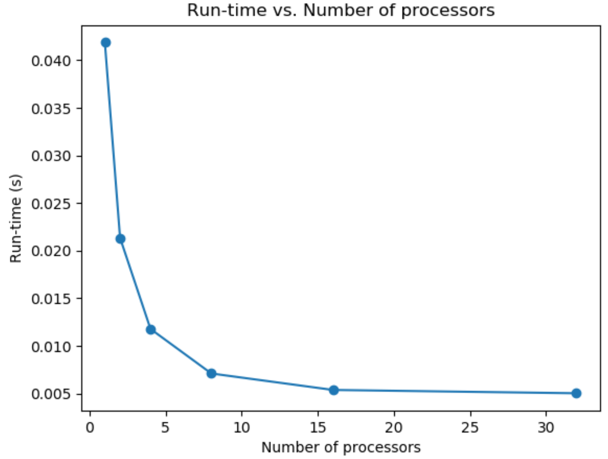

# CSE 6220 Programming Assignment 1

## Team members

Zixuan Wang, Jiashu Li, Yusen Su

## Plot

Below is the plot for run-time vs. number of processors.

The curve shows a downward trend, which is the expected output of a MPI program, indicating that more processors can bring faster computation. Initially, the run-time shows a significant decrease when the number of processors increases. However, the improvement of run-time doesn't show the same pattern when the number of processors is large, e.g., when we switch from 16 processors to 32 processors, the run-time almost has no improvement. This may be due to the communication overhead between processors.

Below is the run-time data and speedup for different number of processors.

| Number of processors | Run-time (s) | Speedup |
| :------------------: | :----------: | :-----: |
|          1           |   0.041872   |    /    |
|          2           |   0.021346   |  1.96   |
|          4           |   0.011784   |  3.55   |
|          8           |   0.007107   |  5.89   |
|          16          |   0.005378   |  7.79   |
|          32          |   0.005030   |  8.32   |

(observation needed)